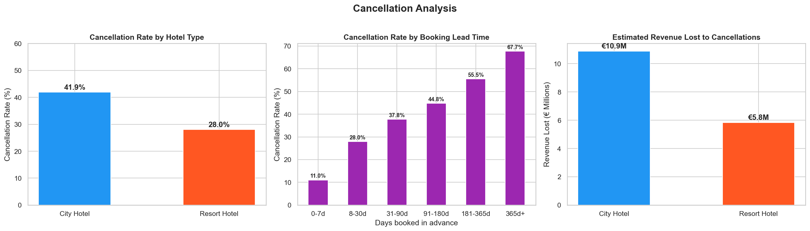
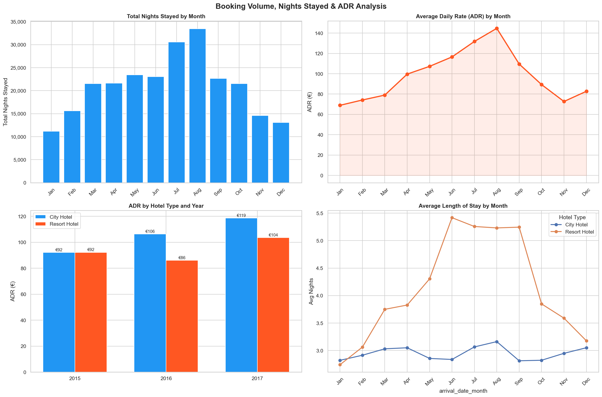
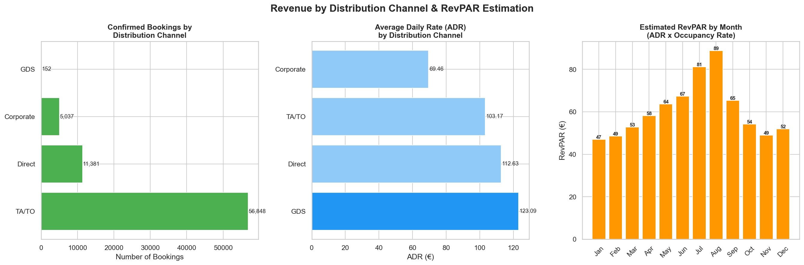

# Hotel Revenue Analysis
## Exploratory Data Analysis of Hotel Booking Performance

**Tools:** Python, pandas, matplotlib, seaborn  
**Dataset:** [Hotel Booking Demand – Kaggle](https://www.kaggle.com/datasets/jessemostipak/hotel-booking-demand)

---

## Overview

Exploratory data analysis of 119,390 hotel bookings across a City Hotel and Resort Hotel 
covering 2015–2017. The analysis applies hospitality industry KPIs including ADR, RevPAR, 
and length of stay to identify revenue patterns, cancellation drivers, and distribution 
channel performance.

This project combines data analytics with 9 years of hands-on experience in hotel 
financial control to produce business-relevant insights.

---

## Key Findings

- Overall cancellation rate of **37.2%** (City Hotel: 41.9% | Resort Hotel: 28.0%), 
  significantly above the industry benchmark of 20–25%
- Estimated **€16.73M in revenue at risk** from cancellations across both properties
- Bookings made **365+ days in advance** show a 67.7% cancellation rate — 
  largely speculative reservations
- **Direct bookings generate €9.46 more ADR** than TA/TO channel, 
  plus zero commission cost
- **August peaks at €144.69 ADR and €88.77 RevPAR** — 47% above January low season
- City Hotel ADR grew **29%** from €92 (2015) to €119 (2017)
- Resort Hotel guests stay **42% longer** than City Hotel guests (4.2 vs 2.95 nights)

---

## Visualisations

### Cancellation Analysis


### Booking Volume, Nights Stayed & ADR


### Distribution Channels & RevPAR


---

## Repository Structure
```
hotel-revenue-analysis/
│
├── README.md
├── notebooks/
│   └── hotel_revenue_analysis.ipynb
├── images/
│   ├── cancellation_analysis.png
│   ├── bookings_adr_analysis.png
│   └── channels_revpar_analysis.png
└── data/
    └── .gitkeep  
```

> Dataset not included. Download from Kaggle link above and place in `data/` folder.

---

## How to Run

1. Clone the repository
2. Download dataset from Kaggle and place `hotel_booking.csv` in `data/`
3. Install dependencies: `pip install pandas matplotlib seaborn jupyter`
4. Open `notebooks/hotel_revenue_analysis.ipynb` in JupyterLab
